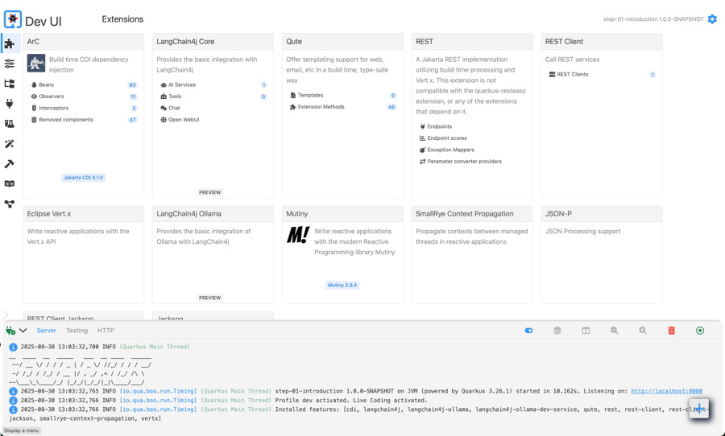

# Step 1 - Introduction

This is the first step where we will introduce the project.
Start by running the following command in this directory:

```shell
# Change directory to this folder
cd step-01-introduction
./mvnw quarkus:dev
```

## Quarkus Dev Mode

This will start Quarkus in development mode. For maximum developer joy the following features are enabled by default:

- [Hot reload](https://quarkus.io/guides/maven-tooling#dev-mode)
- [Continuous Testing](https://quarkus.io/guides/continuous-testing)
- [Dev Services](https://quarkus.io/guides/dev-services)
- [Dev UI](https://quarkus.io/guides/dev-ui)
- ...

### Dev UI

Open your browser at [http://localhost:8080](http://localhost:8080) and navigate to the Dev UI:


From the Dev UI you can explore the application and get a better understanding of how it works:

- Extensions
- Configuration
- Dev Services
- Logs
- ...



Have a look around and try out the different features.

### Chat from Dev UI

We haven't implemented any chatbot yet, but you can already use the Dev UI to chat with the language model.
Navigate to the [chat](http://localhost:8080/q/dev-ui/quarkus-langchain4j-core/chat) and try it out.
You can even set the system message to give instructions to the model.
Try out some different messages and see how the model responds.

> [!NOTE]
> Notice that the model doesn't really care about typos or grammatical errors.
>


### Logs

For easier debugging you can also check the logs for the interactions with the model.

These are enabled with the following [application.properties](src/main/resources/application.properties):

```properties
quarkus.langchain4j.log-requests=true
quarkus.langchain4j.log-responses=true
```

Example output:

```
2025-08-30 14:04:35,153 INFO  [dev.lan.htt.cli.log.LoggingHttpClient] (executor-thread-1) HTTP request:
- method: POST
- url: http://localhost:34941/api/chat
- headers: [Content-Type: application/json]
- body: {
  "model" : "llama3.2",
  "messages" : [ {
    "role" : "user",
    "content" : "Hi!"
  } ],
  "options" : {
    "temperature" : 0.8,
    "top_k" : 40,
    "top_p" : 0.9,
    "stop" : [ ]
  },
  "stream" : false,
  "tools" : [ ]
}

2025-08-30 14:04:38,628 INFO  [dev.lan.htt.cli.log.LoggingHttpClient] (executor-thread-1) HTTP response:
- status code: 200
- headers: [Content-Length: 330], [Content-Type: application/json; charset=utf-8], [Date: Sat, 30 Aug 2025 12:04:38 GMT]
- body: {
  "model": "llama3.2",
  "created_at": "2025-08-30T12:04:38.601433113Z",
  "message": {
    "role": "assistant",
    "content": "Hello! How can I assist you today?"
  },
  "done_reason": "stop",
  "done": true,
  "total_duration": 3401817342,
  "load_duration": 2845416824,
  "prompt_eval_count": 27,
  "prompt_eval_duration": 342279614,
  "eval_count": 10,
  "eval_duration": 213385322
}
```

## Quarkus LangChain4j extension

The [Quarkus LangChain4j](https://docs.quarkiverse.io/quarkus-langchain4j/dev/index.html) extension is already included
in the project.
You can use it with various providers, here we explain how to use it with OpenAI, Ollama or Gemini.
Depending on the provider you have to add the corresponding dependency and configuration to your project.

### Quarkus LangChain4j OpenAI

To use OpenAI with Quarkus you have to add the following dependency to your project:

> [!NOTE]
> You have to set the `OPENAI_API_KEY` environment variable to use OpenAI.
> If you use Ollama you don't have to do this.

```xml

<dependency>
    <groupId>io.quarkiverse.langchain4j</groupId>
    <artifactId>quarkus-langchain4j-openai</artifactId>
</dependency>
```

And set the following configuration:

```properties
quarkus.langchain4j.chat-model.provider=openai
quarkus.langchain4j.openai.api-key=${OPENAI_API_KEY}
quarkus.langchain4j.openai.chat-model.model-name=gpt-4o
```

Or instead use Ollama with OpenAI compatibility:

```properties
quarkus.langchain4j.chat-model.provider=openai
quarkus.langchain4j.openai.base-url=http://localhost:11434/v1/
quarkus.langchain4j.openai.chat-model.model-name=llama3.2
```

For the details of the configuration please refer to
the [documentation](https://docs.quarkiverse.io/quarkus-langchain4j/dev/quickstart.html).

### Quarkus LangChain4j Ollama

To use Ollama directly with Quarkus you have to add the following dependency to your project:

```xml

<dependency>
    <groupId>io.quarkiverse.langchain4j</groupId>
    <artifactId>quarkus-langchain4j-ollama</artifactId>
</dependency>
```

And set the following configuration:

```properties
quarkus.langchain4j.chat-model.provider=ollama
quarkus.langchain4j.ollama.chat-model.model-id=llama3.2
```

For running Ollama you have two options:

- Run it yourself with `ollama run llama3.2` as we saw before
- Or let Quarkus run it for you automatically with devservices

For the details of the configuration please refer to
the [documentation](https://docs.quarkiverse.io/quarkus-langchain4j/dev/guide-ollama.html).

### Quarkus LangChain4j Gemini

To use Gemini with Quarkus you have to add the following dependency to your project:

```xml

<dependency>
    <groupId>io.quarkiverse.langchain4j</groupId>
    <artifactId>quarkus-langchain4j-ai-gemini</artifactId>
</dependency>
```

And set the following configuration:

```properties
quarkus.langchain4j.chat-model.provider=gemini
quarkus.langchain4j.ai.gemini.api-key=${GEMINI_API_KEY}
quarkus.langchain4j.ai.gemini.chat-model.model-id=gemini-2.5-flash
```

For the details of the configuration please refer to
the [documentation](https://docs.quarkiverse.io/quarkus-langchain4j/dev/gemini-chat-model.html).

## Next step

Feel free to explore the rest of the project, and afterwards continue with the
next [step](./../step-02-chatbot/README.md).
