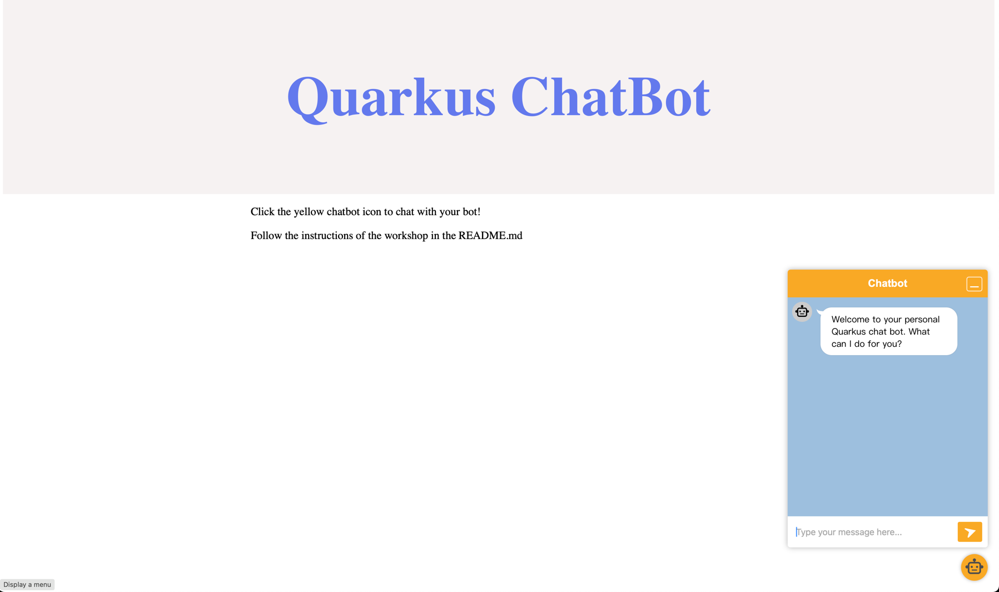

# Step 2 - Chatbot

The next step is to build a chatbot.
This can simply be done by creating a new interface and adding the right annotations
from [Quarkus LangChain4j](https://docs.quarkiverse.io/quarkus-langchain4j/dev/quickstart.html#ai-service).

```java

@SessionScoped
@RegisterAiService
public interface ChatBot {

    String chat(String userMessage);
}
```

This tells Quarkus LangChain4j to register the `ChatBot` interface as an AI service.
It only has one method that accepts a user message and returns a response.

We use `@SessionScoped` to make sure the service is only created once per session to have a dedicated chat per session.

Next, checkout the code in the `ChatBotWebSocket` class how to connect to the chatbot to a websocket.
Here you can personalize the welcome message.

```java

@WebSocket(path = "/chat-bot")
public class ChatBotWebSocket {

    private final ChatBot chatBot;

    public ChatBotWebSocket(ChatBot chatBot) {
        this.chatBot = chatBot;
    }

    @OnOpen
    public String onOpen() {
        return "Welcome to your personal Quarkus chat bot. What can I do for you?";
    }

    @OnTextMessage
    public String onTextMessage(String message) {
        return chatBot.chat(message);
    }
}
```

To enable websocket support, add the following extension:

```xml

<dependency>
    <groupId>io.quarkus</groupId>
    <artifactId>quarkus-websockets-next</artifactId>
</dependency>
```

Furthermore, we need some web UI to interact with the chatbot. Add the following dependencies:

```xml

<dependency>
    <groupId>io.quarkus</groupId>
    <artifactId>quarkus-web-dependency-locator</artifactId>
</dependency>
<dependency>
<groupId>org.mvnpm</groupId>
<artifactId>wc-chatbot</artifactId>
<version>0.2.1</version>
<scope>runtime</scope>
</dependency>
```

Finally, copy over the `index.html` file from
the [step-02-chatbot/src/main/resources/META-INF/resources](src/main/resources/META-INF/resources) folder.

Congratulations, you have built your first chatbot!
You can interact with the bot by opening your browser and navigate to http://localhost:8080/
Click on the chatbot icon in the bottom right corner to open the chat window.



## Model configuration

To change how the bot responds, you can modify the model parameters in the `application.properties` file.
Checkout the
LangChain4j [documentation](https://docs.quarkiverse.io/quarkus-langchain4j/dev/guide-prompt-engineering.html#_chat_model_configuration)
for more information about the available parameters.

### Temperature

The temperature of the model controls how creative the bot is.

```properties
# Configure temperate for all models
quarkus.langchain4j.temperature=0.5
```

Try experimenting with different temperatures and see how the bot responds.
For enterprise grade chatbots avoid higher temperatures to avoid bots getting too creative.

### Max tokens

You can limit the maximum number of tokens the bot can generate  (OpenAI integration only for now).

```properties
# OpenAI
quarkus.langchain4j.openai.chat-model.max-tokens=10
```

A token doesn't match directly to a word or character, but to a chunk of text, roughly 3 characters.

### Configuration reference

For the rest of the workshop you can use the following configuration.

```properties
# Configure temperate for all models
quarkus.langchain4j.temperature=1
# OpenAI
quarkus.langchain4j.openai.chat-model.max-tokens=1000
```

## System message

Checkout the full specification of
the [AI Services](https://docs.quarkiverse.io/quarkus-langchain4j/dev/ai-services.html#_annotations_reference)
in the LangChain4j documentation.
And try to get creative with the system message.
Tweak the `@SystemMessage` to your liking and experiment with different system messages.

## Next step

Now you are ready to move to the next [step](./../step-03-authentication/README.md).
