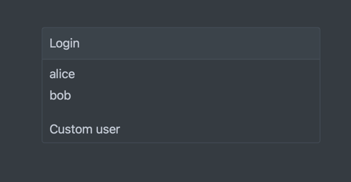

# Step 3 - Authentication

Now that we have a chatbot, we need to add authentication to it to protect it from unauthorized users.
We will leverage the Quarkus OIDC extension to do that.
If you want to learn more about OIDC, you can check
the [official documentation](https://quarkus.io/guides/security-openid-connect) and the tutorials for:

- [OIDC Bearer Token Authentication](https://quarkus.io/guides/security-oidc-bearer-token-authentication)
- [OIDC Code Flow Authentication](https://quarkus.io/guides/security-oidc-code-flow-authentication)


https://www.cncf.io/blog/2023/05/17/securing-cloud-native-microservices-with-role-based-access-control-using-keycloak/

## OIDC Extension

First enable the Quarkus OIDC extension:

```xml

<dependency>
    <groupId>io.quarkus</groupId>
    <artifactId>quarkus-oidc</artifactId>
</dependency>
```

After enabling the extension Quarkus will automatically start a Keycloak server as
a [dev service](https://quarkus.io/guides/security-openid-connect-dev-services#dev-services-for-keycloak).
This also enables the `OpenID Connect` card on the Dev UI which you can explore.

> [!NOTE]
> Instead of pulling another container image for Keycloak we can also enable
> the [OIDC Dev Services](https://quarkus.io/guides/security-openid-connect-dev-services#dev-services-for-oidc) instead.
> This is done by adding the following property to the `application.properties` file:
>
> ```properties
> quarkus.oidc.devservices.enabled=true
> ```
>
> We will use that as the default for now.

For now, we keep the application simple and use the web app type with the code flow authentication as we don't have a
dedicated single page app for the frontend.
To also allow calls with a bearer token, we need to set the application type to `hybrid`:

```properties
quarkus.oidc.application-type=hybrid
```

The rest of the configuration for the OIDC extension is done automatically by Quarkus.
We only need to enforce authentication for all of our endpoints:

```properties
quarkus.http.auth.permission.authenticated.paths=/*
quarkus.http.auth.permission.authenticated.policy=authenticated
```

We can also annotate our endpoints with `@Authenticated` to enforce authentication:

```java
import io.quarkus.security.Authenticated;

@Authenticated
@WebSocket(path = "/chat-bot")
public class ChatBotWebSocket {
    ...
}
```

Furthermore, we can also use the `@RolesAllowed` annotation to restrict access to certain endpoints based on roles.

```java

@GET
@RolesAllowed("admin")
@Path("/admin")
public String admin() {
    return "Admin only";
}
```

## Authentication

Now you should be promoted with a login page on reload.
By default, we have the users `alice` and `bob`.



You can configure the users in the `application.properties` file:

```properties
%dev.quarkus.keycloak.devservices.users.duke=dukePassword
%dev.quarkus.keycloak.devservices.roles.duke=reader
%dev.quarkus.keycloak.devservices.users.john=johnPassword
%dev.quarkus.keycloak.devservices.roles.john=reader,writer
```

## Personalised welcome message

We now have a working authentication mechanism.
We can also add a personalised welcome message to the chatbot.
Simply inject the `SecurityIdentity` and use it to get the username:

```java

@Inject
SecurityIdentity identity;
```

And use it in the welcome message:

```java

@OnOpen
public String onOpen() {
    return "Hi " + identity.getPrincipal().getName() + "Welcome to your personal Quarkus chat bot. What can I do for you?";
}
```

## Next step

Now you are ready to move to the next [step](./../step-04-tools/README.md).
